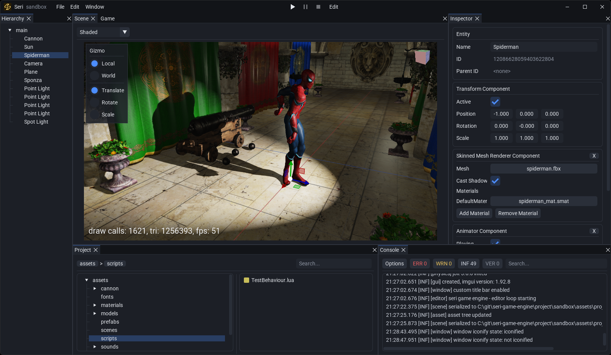

# Seri Game Engine #

* A 2D/3D OpenGL Game Engine.

## Roadmap: ##

* [X] Entity Component System
* [X] Model Loading and Skeletal Animation
* [X] UI System and Text Rendering
* [X] Instancing
* [X] Forward Rendering
* [X] Lighting and Shadow
* [X] PBR
* [X] Sound
* [X] Physics
* [X] Scripting
* [X] Editor and Launcher
* [X] Project System
* [ ] Post Process
* [ ] Particles
* [ ] Build and Packaging
* [ ] NetCode
* [ ] Linux Support
* [ ] DirectX and Vulkan Support

## Install: ##

* See [Install](INSTALL.md)

## Images: ##
<table>
    <tr>
        <td align="center">
            
             
            <i> editor <i>
        </td>
    </tr>
</table>
